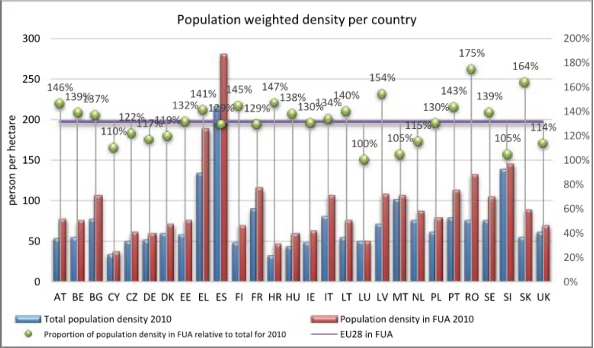

First, I'll start with a simple log plot over time. 

</br>

```{r data, eval=TRUE, echo=FALSE, results='hide', error=TRUE, message=FALSE, warning=FALSE, layout="l-body-outset"}
# Initialise ----
library(countrycode)
library(glue)
library(lubridate)
library(rtweet)
library(scales)
library(tidyverse)
library(wbstats)

country_num <- 12
pop_min <- 10000000
cases_PM_init <- 10

# Get data ----
data <- read_csv('https://raw.githubusercontent.com/CSSEGISandData/COVID-19/master/csse_covid_19_data/csse_covid_19_time_series/time_series_19-covid-Confirmed.csv') %>% 
  select(-Lat, -Long, -`Province/State`) %>% 
  group_by(`Country/Region`) %>% 
  summarise_all(.funs = sum) %>% 
  gather(
    key = "Date", 
    value = "Cases", 
    -`Country/Region`
  ) %>% 
  rename("Country" = `Country/Region`) %>% 
  mutate(
    Date = as.Date(Date, "%m/%d/%y"),
    DateNumber = as.integer(
      Date - as.Date("01/21/20", "%m/%d/%y")
    ),
    Country = str_to_upper(Country)
    )

# countries <- countrycode::codelist
# write_rds(x = countries, path = 'countries.rds')
countries <- read_rds('countries.rds')

# population <- wbstats::wb(country = "all", indicator = "SP.POP.TOTL") %>% 
#   group_by(iso3c) %>% 
#   arrange(desc(date)) %>% 
#   slice(1) %>% 
#   ungroup() %>% 
#   distinct()
# write_rds(x = population, path = 'population.rds')
population <- read_rds('population.rds')


# Tidy data ----
data_tidy <- data %>% 
  left_join(
    countries, 
    by = c('Country' = 'genc.name')
  ) %>% 
  left_join(
    population, 
    by = 'iso3c'
  ) %>% 
  select("Country" = country.name.en, Date, Cases, DateNumber, continent, iso3c, value) %>% 
  filter(
    !is.na(Country),
    value > pop_min
  ) %>% 
  mutate(
    Cases_PM = 1000000 * Cases / value,
    Country = as_factor(Country),
    Country = fct_reorder(
      .f = Country, 
      .x = Cases, 
      .fun = max, 
      .desc = TRUE
      ),
    Country_PM = fct_reorder(
      .f = Country, 
      .x = Cases_PM, 
      .fun = max, 
      .desc = TRUE
      )
    )

data_now <- data_tidy %>%
  filter(
    Date == max(Date)
    ) %>%
  select(-Date) %>%
  arrange(desc(Cases)) %>%
  slice(1:country_num)

data_now_PM <- data_tidy %>%
  filter(
    Date == max(Date),
    !is.na(Country_PM)
  ) %>%
  select(-Date) %>%
  arrange(desc(Cases_PM)) %>%
  slice(1:country_num)


# Rebase per capita cases ----
data_base_value <- data_tidy %>% 
  arrange(Date) %>% 
  group_by(Country) %>% 
  filter(Cases_PM > cases_PM_init) %>% 
  slice(1) %>% 
  ungroup() %>% 
  select(Country, "Date_base" = Date, "DateNumber_base" = DateNumber, "Cases_PM_base" = Cases_PM)
  
data_rebased <- data_tidy %>% 
  left_join(
    data_base_value, 
    by = 'Country'
    ) %>% 
  mutate(
    Cases_PM_rebased = Cases_PM / Cases_PM_base,
    DateNumber_rebased = DateNumber - DateNumber_base
    ) %>% 
  filter(DateNumber_rebased >= 0)

data_tidy %>% 
  filter(Country %in% data_now$Country) %>%
  ggplot(
    aes(
      x = Date,
      y = Cases,
      group = Country,
      colour = Country
    )
  ) + 
  scale_y_continuous(
    trans = "log", 
    labels = label_number(
      big.mark = ','
      )
    ) + 
  geom_line() + 
  theme_minimal() + 
  theme(plot.title.position = "plot") +
  labs(
    x = "",
    y = "",
    colour = "",
    title = "Daily cumulative Covid-19 infections",
    subtitle = "For the twelve countries (of over 10m people) with the most cases \n \n"
  )
```
</br>

Whilst this chart has a log scale, there is no sense of the country's population. 

At some level, of course, cases are cases: they sadly represent people suffering. In other ways, however, a thousand cases in China (with a population of over a billion) suggests a proportionately smaller problem than a thousand cases in Norway (with a population of just over 5 million).

Furthermore, as Justin Wolfers rightly says below, both types of log analysis are will show the same growth rates.

<blockquote class="twitter-tweet"><p lang="en" dir="ltr">The vertical axis shows total cases on a log scale, so it&#39;s like graphing log(cases) on a regular scale.<br><br>A per capita graph shows log(cases/population) which = log(cases)-log(population).<br><br>Total population is barely moving day to day, so this is like log(cases)-constant.</p>&mdash; Justin Wolfers (@JustinWolfers) <a href="https://twitter.com/JustinWolfers/status/1241105188011806720?ref_src=twsrc%5Etfw">March 20, 2020</a></blockquote> <script async src="https://platform.twitter.com/widgets.js" charset="utf-8"></script>

In the following chart, I show the cases per million of population, but only in instances where there have already been many cases. (That way, the constant term noted above becomes less relevant.)

To my mind, once the virus becomes (sadly) more widespread, this version of the analysis becomes ever more useful, particularly when comparing the effectiveness of action across different countries.

</br>

```{r rebased, eval=TRUE, echo=FALSE, results='hide', error=TRUE, message=FALSE, warning=FALSE, layout="l-body-outset", preview=TRUE}
data_rebased %>% 
  filter(Country %in% data_now_PM$Country_PM) %>% 
  mutate(
    Country_PMR = fct_reorder(
      .f = Country, 
      .x = Cases_PM_rebased, 
      .fun = max, 
      .desc = TRUE
      )
  ) %>% 
  ggplot(
    aes(
      x = DateNumber_rebased,
      y = Cases_PM_rebased,
      group = Country_PMR,
      colour = Country_PMR
    )
  ) + 
  scale_y_continuous(
    trans = "log", 
    labels = label_number(
      big.mark = ','
    )
  ) + 
  geom_line() + 
  theme_minimal() +
  theme(plot.title.position = "plot") +
  labs(
    x = "",
    y = "",
    colour = "",
    title = "Cumulative Covid-19 infections per million inhabitants",
    subtitle = "For the twelve countries (of over 10m people) with the most per-capita cases \nShown against days since cumulative infections first exceeded 10 per million \n \n"
  )
```
</br>

The pessimist in me sees the chart above as sobering. Essentially, most of these countries seem to experience similar rates of per-capita infection. Perhaps this is just for those countries with the most per-capita cases. Or maybe this is a very unfortunate feature of the outbreak. Anyhow, I will leave the reasoning to domain experts (rather than curious data types).

Either way, I have a suspicion that *population-weighted density* (rather than *population density*) will become a familiar term soon. The chart below shows more, and seems worrying for Spain, with further details available in the paper that is referenced in the Appendix.

</br>



##   {.appendix}

For completeness (and reproducibility), here's the code that I used to calculate what's above. 

## Data and simple log chart {.appendix}

```{r data, ref.label='data', echo=TRUE, eval=FALSE}
```

## Rebased chart {.appendix}
  
```{r rebased, ref.label='rebased', echo=TRUE, eval=FALSE}
```

## References {.appendix}

> Kompil M, Aurambout J, Ribeiro Barranco R, Barbosa A, Jacobs-Crisioni C, Pisoni E, Zulian G, Vandecasteele I, Trombetti M, Vizcaino M, Vallecillo Rodriguez S, Batista e Silva F, Baranzelli C, Mari Rivero I, Perpiña Castillo C, Polce C, Maes J, Lavalle C., 2015, European cities: territorial analysis of characteristics and trends - An application of the LUISA Modelling Platform (EU Reference Scenario 2013 - Updated Configuration 2014), EUR 27709 EN, doi:10.2788/737963

## System settings {.appendix}

```{r, eval=TRUE, echo=FALSE}
sessionInfo()
```
