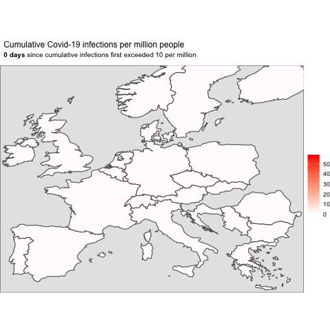

In other words, the analysis below follows-up on [my post last week](https://www.p0bs.com/posts/2020-03-14-covid/).

What did I do in that post? Well, for each of the twelve large countries with the most per-capita cases, I considered the cumulative Covid-19 infections per million inhabitants. I charted these figures against what I call the 'time since the outbreak' -- that is, the days since that country's cumulative infections first exceeded 10 per million.

In this analysis, I animate these details over time, showing the proportion of cases per country against the time since the outbreak.

Doing so generates the following animation (the code for which is in the Appendix below).



</br>

Overall, it adds to the sobering impression that many countries are on a similar unfortunate path.

</br>

```{r data, eval=TRUE, echo=FALSE, results='hide', error=TRUE, message=FALSE, warning=FALSE, layout="l-body-outset", preview=TRUE}
# Initialise ----
library(countrycode)
library(gganimate)
library(ggtext)
library(glue)
library(lubridate)
library(maps)
library(rtweet)
library(scales)
library(sf)
library(tidyverse)
library(wbstats)

country_num <- 20
pop_min <- 4000000
cases_PM_init <- 10


# Get data ----
data <- read_csv('https://raw.githubusercontent.com/CSSEGISandData/COVID-19/master/csse_covid_19_data/csse_covid_19_time_series/time_series_19-covid-Confirmed.csv') %>% 
  select(-Lat, -Long, -`Province/State`) %>% 
  group_by(`Country/Region`) %>% 
  summarise_all(.funs = sum) %>% 
  gather(
    key = "Date", 
    value = "Cases", 
    -`Country/Region`
  ) %>% 
  rename("Country" = `Country/Region`) %>% 
  mutate(
    Date = as.Date(Date, "%m/%d/%y"),
    DateNumber = as.integer(
      Date - as.Date("01/21/20", "%m/%d/%y")
    ),
    Country = str_to_upper(Country)
  )

# countries <- countrycode::codelist
# write_rds(x = countries, path = 'countries.rds')
countries <- read_rds('countries.rds')

# population <- wbstats::wb(country = "all", indicator = "SP.POP.TOTL") %>% 
#   group_by(iso3c) %>% 
#   arrange(desc(date)) %>% 
#   slice(1) %>% 
#   ungroup() %>% 
#   distinct()
# write_rds(x = population, path = 'population.rds')
population <- read_rds('population.rds')


# Tidy data ----
data_tidy <- data %>% 
  left_join(
    countries, 
    by = c('Country' = 'genc.name')
  ) %>% 
  left_join(
    population, 
    by = 'iso3c'
  ) %>% 
  select("Country" = country.name.en, Date, Cases, DateNumber, continent, iso3c, value) %>% 
  filter(
    !is.na(Country),
    value > pop_min
  ) %>% 
  mutate(
    Cases_PM = 1000000 * Cases / value,
    Country = as_factor(Country),
    Country = fct_reorder(
      .f = Country, 
      .x = Cases, 
      .fun = max, 
      .desc = TRUE
    ),
    Country_PM = fct_reorder(
      .f = Country, 
      .x = Cases_PM, 
      .fun = max, 
      .desc = TRUE
    )
  )


# Rebase per capita cases ----
data_base_value <- data_tidy %>% 
  arrange(Date) %>% 
  group_by(Country) %>% 
  filter(Cases_PM > cases_PM_init) %>% 
  slice(1) %>% 
  ungroup() %>% 
  select(Country, "Date_base" = Date, "DateNumber_base" = DateNumber, "Cases_PM_base" = Cases_PM)

data_rebased <- data_tidy %>% 
  left_join(
    data_base_value, 
    by = 'Country'
  ) %>% 
  mutate(
    Cases_PM_rebased = Cases_PM / Cases_PM_base,
    DateNumber_rebased = DateNumber - DateNumber_base
  ) %>% 
  filter(DateNumber_rebased >= 0)


# Global chart ----
country <- st_as_sf(
  maps::map(
    database = 'world', 
    plot = FALSE, 
    fill = TRUE
    )
  )

countries <- cbind(
  country, 
  st_coordinates(st_centroid(country))
  ) %>% 
  as_tibble() %>% 
  mutate(
    name_country = str_to_title(
      countrycode(
        sourcevar = ID, 
        origin = 'country.name.en',
        destination = 'genc.name')
      )
    ) 

data_rebased_country <- data_rebased %>% 
  filter(continent == "Europe") %>% 
  left_join(countries, by = c('Country' = 'name_country'))

data_rebased_country_wide <- data_rebased_country %>% 
  select(Country, iso3c, DateNumber_rebased, X, Y, geom, Cases_PM_rebased) %>% 
  pivot_wider(
    names_from = DateNumber_rebased, 
    values_from = Cases_PM_rebased,
    values_fill = list(Cases_PM_rebased = 0)
    ) %>% 
  pivot_longer(
    cols = -c(Country, iso3c, X, Y, geom),
    names_to = "DateNumber_rebased", 
    values_to = "Cases_PM_rebased"
    ) %>% 
  mutate(DateNumber_rebased = as.integer(DateNumber_rebased))

animation <- data_rebased_country_wide %>% 
  filter(DateNumber_rebased <= 20) %>% 
  ggplot() + 
  geom_sf(
    aes(
      geometry = geom, 
      fill = Cases_PM_rebased
      )
    ) + 
  coord_sf(
    xlim = c(-10.7, 30),
    ylim = c(34.6, 65),
    expand = FALSE
    ) + 
  scale_fill_binned(type = "gradient") +
  scale_fill_gradient(
    low = "white", 
    high = "red", 
    trans = "log", 
    labels = label_number(
      big.mark = ',', 
      accuracy = 2
      )
  ) +
  theme_void() + 
  theme(
    panel.background = element_rect(fill = 'grey90'),
    plot.title.position = "plot",
    plot.title = element_textbox_simple(
      size = 12,
      lineheight = 1,
      padding = margin(5.5, 5.5, 2, 5.5)
    ),
    plot.subtitle = element_textbox_simple(
      size = 10,
      lineheight = 1,
      padding = margin(2, 5.5, 11, 5.5)
      )
    ) + 
  labs(
    title = "Cumulative Covid-19 infections per million people",
    subtitle = '**{frame_time} days** since cumulative infections first exceeded 10 per million',
    fill = ''
  ) +
  transition_time(DateNumber_rebased) +
  enter_fade() + 
  exit_shrink() +
  ease_aes('sine-in-out')

# gganimate::anim_save(
#   animation = animation,
#   filename = 'europe.gif'
#   )

data_rebased_country_wide %>% 
  filter(DateNumber_rebased <= 15) %>% 
  ggplot() + 
  geom_sf(
    aes(
      geometry = geom, 
      fill = Cases_PM_rebased
      )
    ) + 
  coord_sf(
    xlim = c(-10.7, 30),
    ylim = c(34.6, 65),
    expand = FALSE
    ) + 
  scale_fill_gradient(
    low = "white", 
    high = "red", 
    trans = "log", 
    labels = label_number(
      big.mark = ',', 
      accuracy = 2
      )
    ) +
  theme_void() + 
  theme(
    panel.background = element_rect(fill = 'grey90'),
    plot.title.position = "plot"
    ) + 
  labs(
    title = "Cumulative Covid-19 cases per million people",
    subtitle = 'Days since cumulative infections first exceeded 10 per million \n',
    fill = ''
  ) + 
  facet_wrap(
    ~DateNumber_rebased, 
    ncol = 4
    )
```

</br>

##   {.appendix}

For completeness (and reproducibility), here's the code that I used to calculate what's above. 

## Data and animation {.appendix}

```{r data, ref.label='data', echo=TRUE, eval=FALSE}
```

## System settings {.appendix}

```{r, eval=TRUE, echo=FALSE}
sessionInfo()
```
