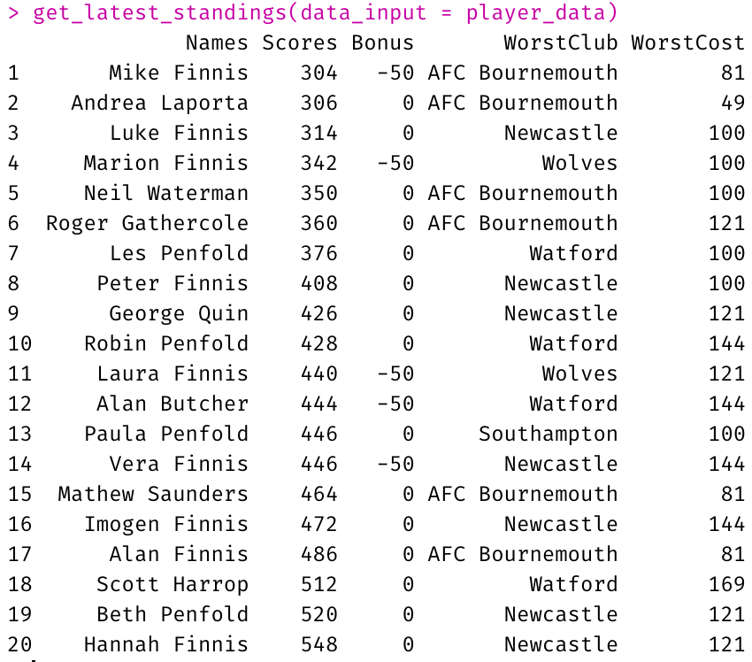

Note that you can find out more details on the package's [GitHub page](https://github.com/p0bs/premPredictor).

<p>&nbsp;</p>

## Using the package

To show what the package can do, let's use it to download the predictions of all the players, before calculating the standings.

```{r, eval=FALSE, echo=TRUE, results='markup', warning=FALSE, message=FALSE}
library(premPredictor)
  
player_data <- get_player_data("https://www.dropbox.com/s/uin6zk4w5cyk2m1/PremPredict-18-19.csv")
  
get_latest_standings(data_input = player_data)
```

Doing so generates the following results.

{width=200px}
  
Please feel free to try it out (and post an issue if required).

