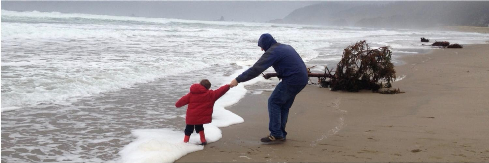

```{r setup, include=FALSE}
knitr::opts_chunk$set(echo = FALSE)
```

```{r, layout="l-screen-inset"}

```

<p style="height: .5em;">&nbsp;</p>

  * At work -- Leading [my firm's](https://www.willistowerswatson.com/en-US/Solutions/investments) quant analysis of asset managers, using investment techniques and data science
  
  * As a volunteer -- Helping charities to get more from their data with [DataKind](https://www.datakind.org/chapters/datakind-uk)
  
  * Otherwise -- With my family and friends, and supporting sports teams that rarely win

<p style="height: .5em;">&nbsp;</p>